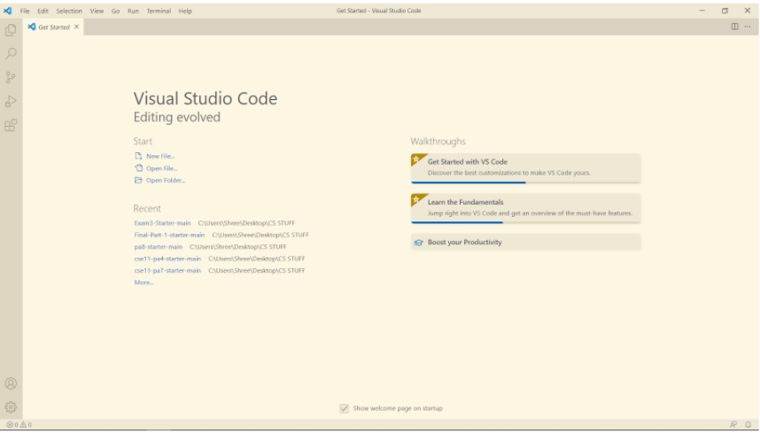
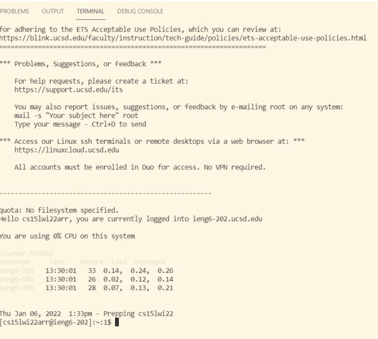

# **Lab Report 1**
By Shree Gopalakrishnan (PID: A16932989)

This is a tutorial for incoming CSE 15L students on how to set up, put files into, and optimize running a remote directory.

## Installing VS Code on your Local Machine
You should navigate onto the Visual Studio Code website https://code.visualstudio.com/, and follow the instructions to download and install it on your computer. After you complete the installation process, you should have a start screen that looks something like this:

## Remotely Connecting to the Remote Desktop
To remotely connect to the desktop, there are a few steps that you must take before attempting. Firstly, if you're on a Windows PC, then you must check if you have OpenSSH, which you can find
[here](https://docs.microsoft.com/en-us/windows-server/administration/openssh/openssh_install_firstuse). 

Then, look up your course-specific account for CSE15L [here](https://sdacs.ucsd.edu/~icc/index.php). 

After all that, open your terminal in VS Code and type in this:

$ ssh cs15lwi22zz@ieng6.ucsd.edu

Except replace the "zz" with your course specific account. If you've done it right, it should look something like this:

## Trying Some Commands

