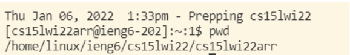
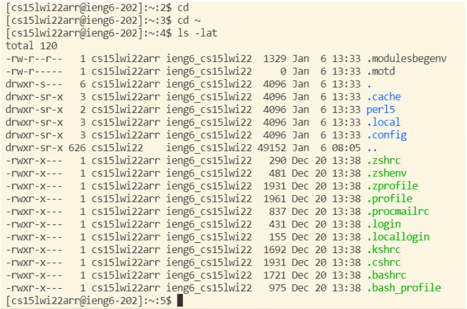
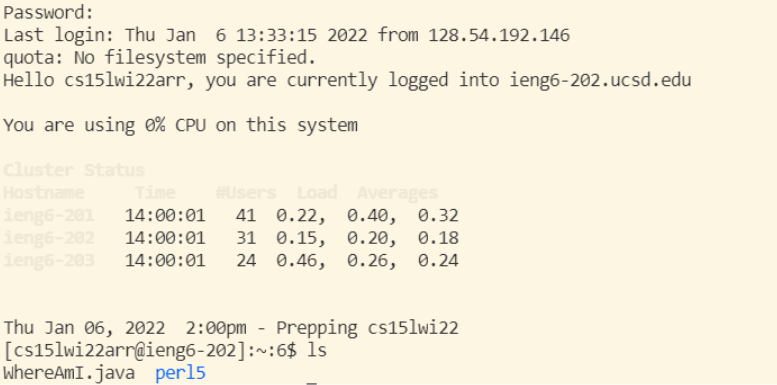
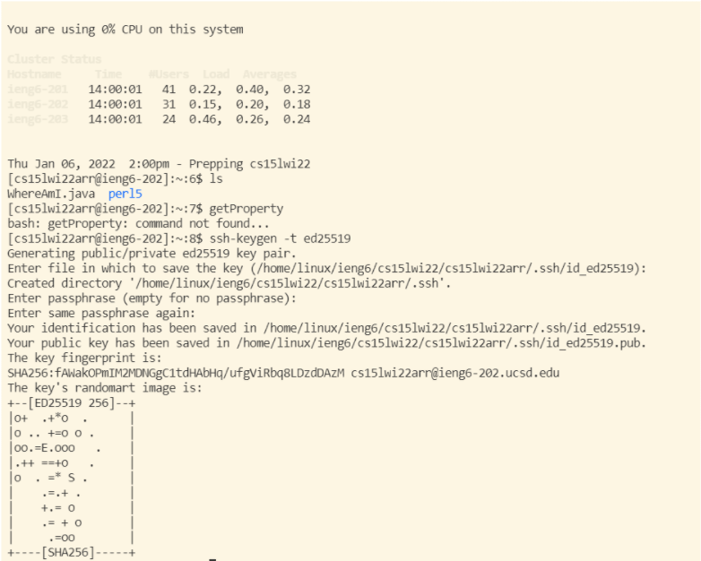
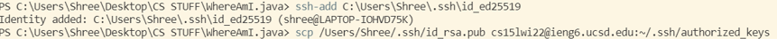

# **Lab Report 1**
By Shree Gopalakrishnan (PID: A16932989)

This is a tutorial for incoming CSE 15L students on how to set up, put files into, and optimize running a remote directory.

## Installing VS Code on your Local Machine
You should navigate onto the Visual Studio Code website https://code.visualstudio.com/, and follow the instructions to download and install it on your computer. After you complete the installation process, you should have a start screen that looks something like this:

## Remotely Connecting to the Remote Desktop
To remotely connect to the desktop, there are a few steps that you must take before attempting. Firstly, if you're on a Windows PC, then you must check if you have OpenSSH, which you can find
[here](https://docs.microsoft.com/en-us/windows-server/administration/openssh/openssh_install_firstuse). 

Then, look up your course-specific account for CSE15L [here](https://sdacs.ucsd.edu/~icc/index.php). 

After all that, open your terminal in VS Code and type in this:

$ ssh cs15lwi22zz@ieng6.ucsd.edu

Except replace the "zz" with your course specific account. If you've done it right, it should look something like this:

## Trying Some Commands

Try some commands in the terminal to see what kind of directory you're in, what files are in your directory, etc. Some useful commands to try are: cd, ls, pwd, mkdir, and cp.

It should look something like this:

## Moving files with scp

Try creating a file on your personal machine and moving it to the remote desktop with the command: 

scp [Your File Name] cs15lwi22zz@ieng6.ucsd.edu:~/

Then if you ls on your remote directory, you should see this:

## Setting up an SSH Key

To optimize your workflow, instead of logging in with your passcode every single time, you can create a public and private key to store on your remote desktop and personal machine respectfully. That way, each time you log in, your private key will initiate the log in process instead of you typing in a passcode. You should run this to set this up:

Once you run that, you should set up a private key on your own computer like this and access without a passcode like this:

## Optimizing even further

Once you can log onto your remote directory without a passcode, you should be able to run multiple command line commands directly to the remote directory, without a passcode.

You can use such commands like: 

$ ssh cs15lwi22@ieng6.ucsd.edu "ls"

directly without logging in. You can also run multiple commands on each line with semi colons seperating the commands like:

$ cp WhereAmI.java OtherMain.java; javac OtherMain.java; java WhereAmI

## **Thats It! You're done! Congrats!**

