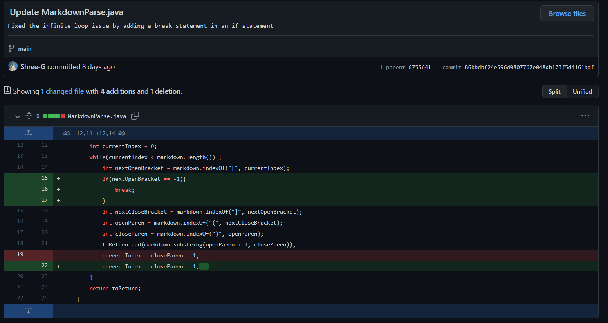
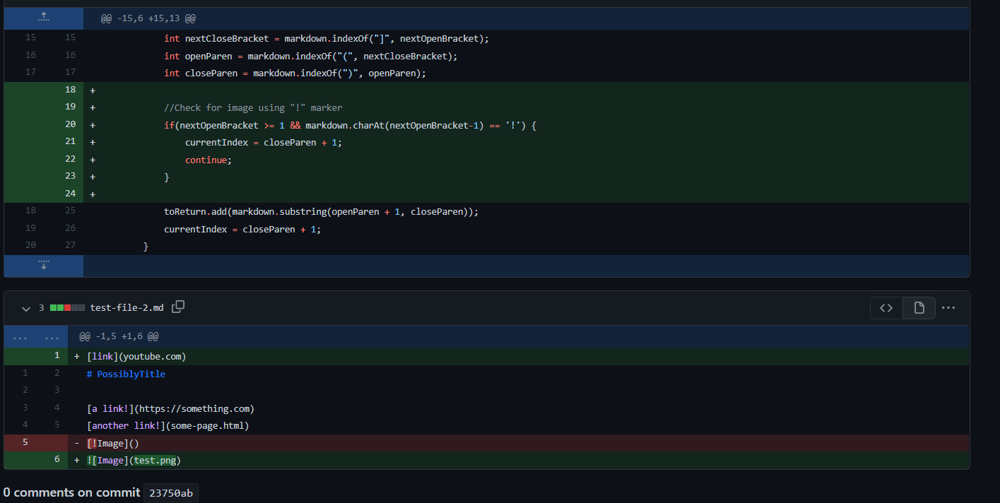
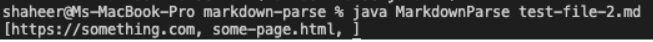
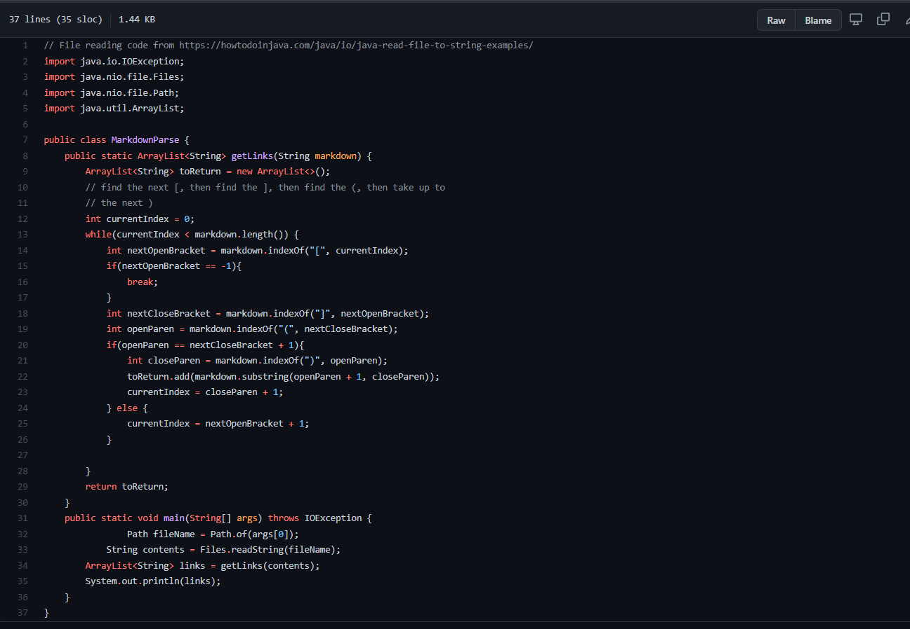

# **Lab Report 1**
By Shree Gopalakrishnan (PID: A16932989)

This lab report is about the changes to the MarkdownParse.java file that fixed multiple bugs in the code.

## First Issue
The first issue we had was that when we added text after the links in the .md file, the program ran into an infinite loop. To fix, this, I wrote a break statement to break the loop if there were no links in the md file henceforth. Here are the changes to the code I made:

The code that caused the issue is in [this file](https://raw.githubusercontent.com/Shree-G/markdown-parse/main/test-file2.md).

The output of the file in the terminal just caused the terminal to crash.

I think the program could not handle the extra characters at the end, because it kept searching for the new link. The original program expected the very last line to be a link, when it didn't really need to be.

## Second Issue
The second issue that one of my groupmates ran into was that the .md file produces a faulty output because the program couldn't differentiate between an image file and a normal link. Here are the changes to the code we made:

The code that caused the issue is in [this file]()

The output of the file in the terminal looked like this:

I think the program could not differentiate between an image file and a link even though the image file had an exclamation point in the front. This was fixed by checking if the file had an exclamation point with an if-statement.

## Third Issue
The third issue was that the program couldn't differentiate between normal open and close brackets in the text file and if it was actually an image file. Here are the changes we made:

The code that caused the issue is in [this file](https://raw.githubusercontent.com/Shree-G/markdown-parse/main/test-file2.md).

I think the program did not know how to differentiate between normal brackets and parantheses. We fixed this by checking if the closing bracket was next to the opening parantheses before adding the link to the ArrayList.

