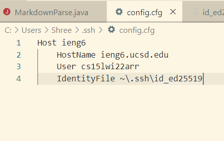
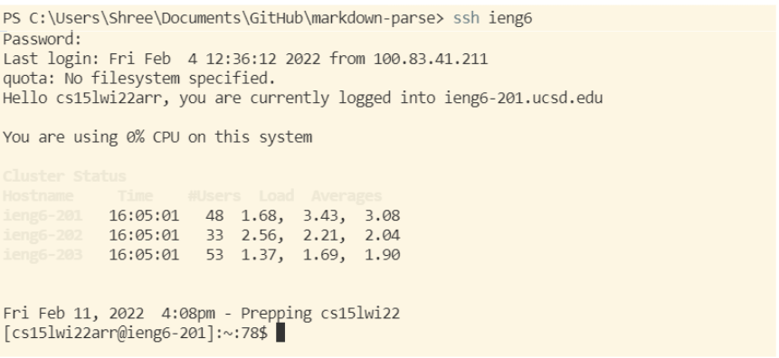
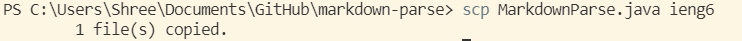

# **Lab Report 3**
By Shree Gopalakrishnan (PID: A16932989)

This lab report is about the choose your own adventure Lab, and the adventure I chose to do. I chose to streamline my ssh configuration. 

Here is my .ssh\config file:

Here is me logging in using the shortened ssh catchphrase:

Here is me using scp using the shortened catchphrase:
