# **Lab Report 4**
By Shree Gopalakrishnan (PID: A16932989)

This Lab report is about three different test files that we test with our implementation of the code, and the group's code that we reviewed.

Here is the [link](https://github.com/Shree-G/markdown-parse) to my repo.

Here is the [link](https://github.com/c1peng/markdown-parse) to the repo I reviewed.

## Snippet 1:

Our code:

The first snippet should produce "`google.com, google.com, ucsd.edu" according to the VS Code Preview:

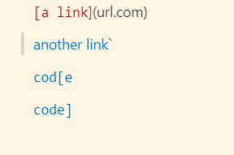

The test itself should look like this:
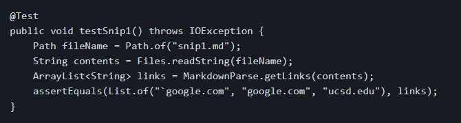

Yet it produces this when we run the test according to our code, as it fails:

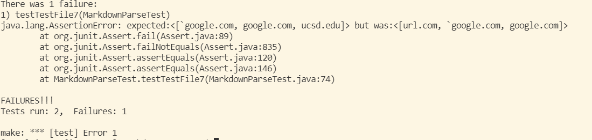

Their Code:

When we run the same test on their code, this is what it produces:

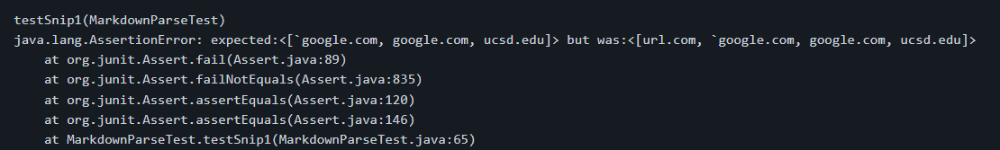

For Question 1, I think this is a fix that could be implemented super easily, because we need to check for blocks of code that have backticks surrounding them first before going ahead with the program.

## Snippet 2:

The second snippet should produce "a.com, a.com(()), example.com" according to the VS Code preview: 

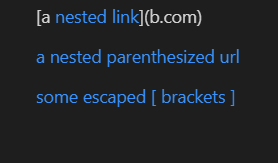

The test itself should look like this:
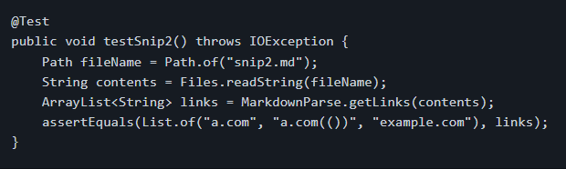

Our Code: 
When we run the test on our code, this is what it produces:

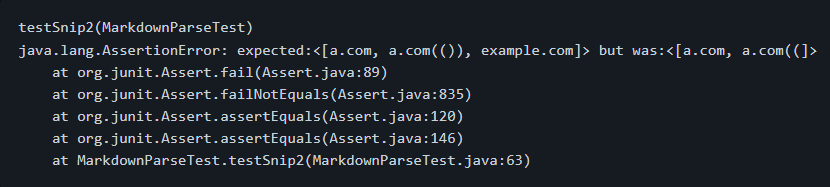

Their Code:

When we run the same test on their code, this is what it produces:

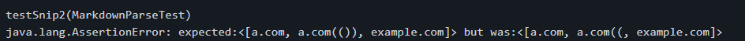

For Question 2, I think this would be much harder to fix, as it would need to check where nested links would take place, as well as if there are brackets in normal text that would not be considered a link. I don't think this could be a fix that could be implemented in less than 10 lines, but I might be wrong.

## Snippet 3:

The third snippet should produce "https://ucsd-cse15l-w22.github.io/" according to the VS Code Preview:

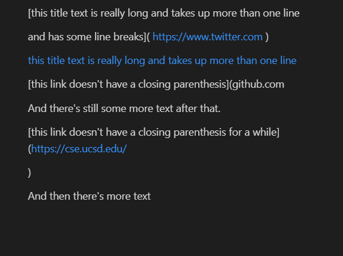

The test itself should look like this:
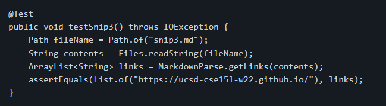

Our Code:
When we run the test on our code, this is what it produces:

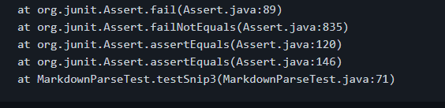

Their Code:
When we run the test on their code, this is what it produces:

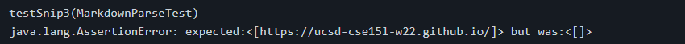

For Question 3, I think this could be fixed under 10 lines, because you would need to remove the whitespace in your program, but that isn't too hard to implement at all. 

