# **Lab Report 5**
By Shree Gopalakrishnan (PID: A16932989)

In this lab report we examine two different test cases provided in the commonmark-spec tests for both our implementation and the common MarkdownParse implementation.

I first cloned the shared version of MarkdownParse on my personal computer, and edited the ```script.sh``` file on both the shared MarkdownParse and my own MarkdownParse in this way:

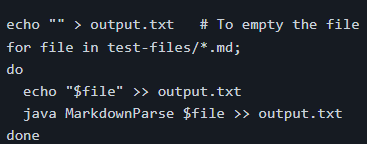

Then I ran both, and got two seperate ```output.txt``` files. On both of these, I ran the ```diff``` command, and got a file with the differences in both of these files. Here are two of the sample outputs in the diff file:

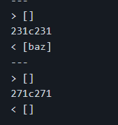

This is how I found the differences in both files. My group next chose to focus on two test files in which our implementation did not match up with the common implementation, and thus provided two different outputs. We ended up choosing Test 519, and Test 567.

## Test 519

Test 519 contains this:

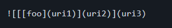

According to the commonmark.js website which shows the previews of the .md files, this is what that test is supposed to look like:

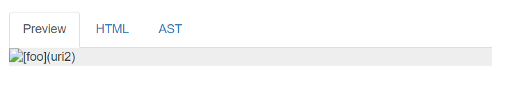

As can be seen, the commonmark.js site sees this as a image file instead of a website, so MarkdownParse should be empty. 

Running this test on my MarkdownParse provides this output:

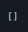

Running this test on the common MarkdownParse provides this output:

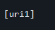

As you can see, our code has the correct implementation of this test, and the common MarkdownParse is wrong according to commonmark.js website.

To fix this error, the common MarkdownParse would presumably need to count the amount of forward brackets and decide based on how many there are if the code is a link or an image, or even something else alltogether. The code that should be fixed is here:

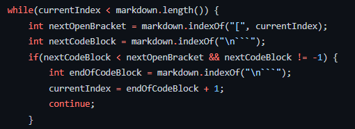

Specifically, the number of next open brackets would need to be counted using some form of loop to make sure the implementation is correct.

## Test 567

Test 567 contains this:

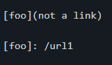

According to the commonmark.js website which shows the previews of the .md files, this is what that test is supposed to look like:

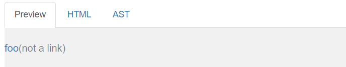

As you can see the ```foo``` is a clickable link that seems to link to ```/url1```. That means the correct output should just be ```/url1```. 

Running this test on my MarkdownParse provides this output:

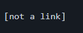

Running this test on the common MarkdownParse provides this output:


It seems both implementations are wrong. In my implementation, the output is ```not a link```, but that is not correct, as links should not have spaces according to .md guidelines. So, my program should check if links have spaces right after this loop:

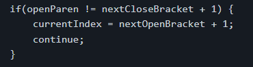

And then not include that link if the link itself has spaces.

The reason the common MarkdownParse did not include ```/url1``` was because it does not check for footnotes, which are links that are linked using text but the link comes below the footnote. That is why ```not a link``` was not included as a link. The check for footnotes should come before most things in the code, as seen here:

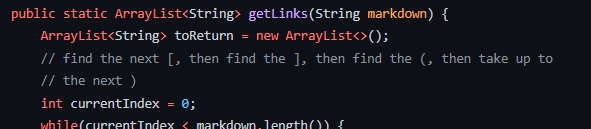

The check for footnotes should come before I even try to parse through to find links, because it is a special case. 

